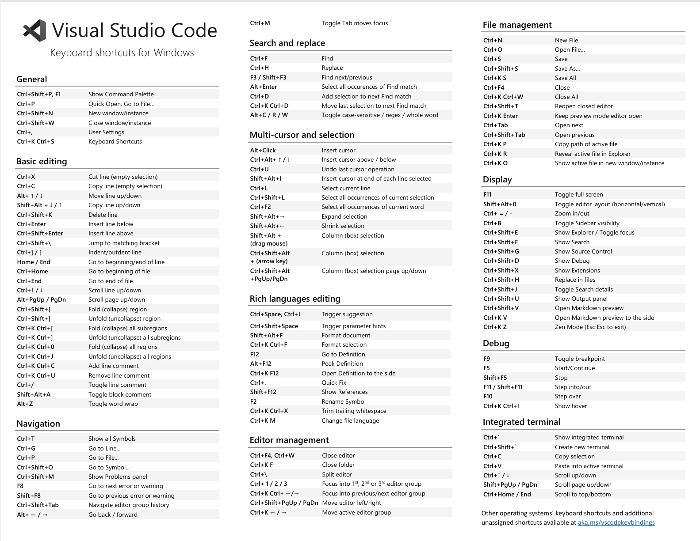

# 基础配置

- `settings.json`

```json
"update.mode": "none",
  "update.enableWindowsBackgroundUpdates": false,
  "window.restoreWindows": "all",
  "window.zoomLevel": 2,              // 缩放级别  
  "files.autoSave": "afterDelay",
  "editor.mouseWheelZoom": true,      // 启用鼠标滚轮缩放
  "editor.cursorSmoothCaretAnimation": "on",
  "terminal.integrated.profiles.windows": {
    "Command Prompt": {
      "path": "C:\\WINDOWS\\System32\\cmd.exe"
    }
  },
  "terminal.integrated.cwd": "${fileDirname}",
  "terminal.integrated.defaultProfile.windows": "Command Prompt", // 默认终端cmd.exe
  "security.workspace.trust.untrustedFiles": "open",              // 允许未受信任的文件在工作区中打开
  "workbench.iconTheme": "office-material-icon-theme",           // 文件图标主题设置
  "editor.codeActionsOnSave": {},
  "workbench.colorTheme": "Visual Studio Dark - C++",
  "workbench.settings.applyToAllProfiles": [ // 指定哪些设置项在切换不同的配置文件时保持同步
  ],
  "workbench.editorAssociations": {
    "*.copilotmd": "vscode.markdown.preview.editor",
    "*.ipynb": "jupyter-notebook",
    "*.bin": "default"
  },
  "workbench.editor.empty.hint": "text",
  "workbench.secondarySideBar.defaultVisibility": "hidden",
  "workbench.colorCustomizations": {                              // 自定义终端颜色
    "terminal.background": "#E3EFEF",
    // "terminal.foreground": "#6D828E",
    "terminal.foreground": "#000000",
    "terminalCursor.background": "#6D828E",
    "terminalCursor.foreground": "#6D828E",
    "terminal.ansiBlack": "#E3EFEF",
    "terminal.ansiBlue": "#868CB3",
    "terminal.ansiBrightBlack": "#98AFB5",
    "terminal.ansiBrightBlue": "#868CB3",
    "terminal.ansiBrightCyan": "#86B3B3",
    "terminal.ansiBrightGreen": "#87B386",
    "terminal.ansiBrightMagenta": "#B386B2",
    "terminal.ansiBrightRed": "#B38686",
    "terminal.ansiBrightWhite": "#485867",
    "terminal.ansiBrightYellow": "#AAB386",
    "terminal.ansiCyan": "#86B3B3",
    "terminal.ansiGreen": "#87B386",
    "terminal.ansiMagenta": "#B386B2",
    "terminal.ansiRed": "#FF4444",
    "terminal.ansiWhite": "#6D828E",
    "terminal.ansiYellow": "#AAB386"
  },
  "workbench.startupEditor": "none",

  "editor.formatOnPaste": true,                             // 粘贴时自动格式化 
  "editor.fontLigatures": false,      
  "editor.fontVariations": false,
  "editor.autoIndentOnPaste": true,                         // 粘贴时自动缩进   
  "explorer.confirmPasteNative": false,
  "editor.suggestSelection": "first",
  "explorer.confirmDelete": false,

  "terminal.integrated.enableMultiLinePasteWarning": "never", 
  "terminal.integrated.fontSize": 20, // 终端字体大小
  "terminal.integrated.autoReplies": {},
  "terminal.integrated.env.linux": {},

  "[cpp]": {
  
    "editor.wordBasedSuggestions": "off",
    "editor.suggest.insertMode": "replace",
    "editor.semanticHighlighting.enabled": true
  },

  "git.useEditorAsCommitInput": true,
  "git.enableSmartCommit": true,
  "git.confirmSync": false,
  "notebook.lineNumbers": "on",
  "notebook.cellToolbarLocation": {
    "default": "right",
    "jupyter-notebook": "left" // .ipynb 文件单元格工具栏位置设置
  },

  "vscode-office.openOutline": true, // 启用 Office 文件打开时自动显示大纲

  "diffEditor.hideUnchangedRegions.enabled": true,

  "extensions.autoUpdate": true,
  "extensions.autoCheckUpdates": false,
```

- `tasks.json`:用来将项目所需的重复性命令（如编译、测试、启动服务）固化为可在VS Code中一键运行的自动化任务 # TODO
# 基础操作

- Windows的快捷键一览
  

- 个人高频使用快捷键

| 快捷键              | 功能说明                               |
| :------------------ | :------------------------------------- |
| `Ctrl+Shift+P`               | 打开命令面板                             |
| `Ctrl+Shift+Tab`  | 在打开的文件中跳转  |
| `Ctrl+P`  | 快速打开文件  |
| `Shift+Alt+拖动光标`  | 列选择  |
| `Alt+Left/Right`  | 后退/前进  |
| `Ctrl+K Ctrl+0`  | 折叠所有区域 |
| `Ctrl+K Ctrl+J`  | 展开所有区域 |

## [内置Git使用](vscode-Git.md)

# 插件

- 安装方法：
  - 1、在扩展商店中（`Ctrl+Shift+X`）搜索安装；
  - 2、命令行中安装，例如：`code --install-extension ms-vscode.cpptools`

## Vim

- [Vim下载地址](https://marketplace.visualstudio.com/items?itemName=vscodevim.vim)
- Vim键位：
  

- [个人配置设置](vscode-Vim.md)


## Git History

- [Git History 下载地址](https://marketplace.visualstudio.com/items?itemName=donjayamanne.githistory)
- 选中需要查看的文件，点击右键，选择“Git：View File History”或者快捷键 `ALT + H`，即可查看该文件的提交历史。

## Git Graph

- [Git Graph 下载地址](https://marketplace.visualstudio.com/items?itemName=mhutchie.git-graph)
- 点击Vscode 左侧源代码管理GitGraph图标 或者  code下面 `GitGraph`选项即可将文件的提交历史以图形化的方式展示出来。
- 点击某个commit会显示和上一个commit的差异（绿色表示新增，黄色表示修改），如果要查看某两个commit之间的差异，可以Ctrl选中两个文件进行查看

## Open in GitHub, Bitbucket, Gitlab, VisualStudio.com !

- [Open in GitHub, Bitbucket, Gitlab, VisualStudio.com ! 下载地址](https://marketplace.visualstudio.com/items?itemName=ziyasal.vscode-open-in-github)
- 一键打开当前代码GitHub、Git等远程仓库地址，若选中代码行或区域，则直接定位到指定位置。选中文件或区域，点击右键，选择“Open in GitHub”即可打开指定文件或区域的远程仓库页面。

## Todo Tree

- [Todo Tree 下载地址](https://marketplace.visualstudio.com/items?itemName=Gruntfuggly.todo-tree)
- 个人配置

```json
{
  // 自定义高亮关键词
  "todo-tree.general.tags": [
    "BUG",
    "HACK",
    "FIXME",
    "TODO",
    "TEMP",
    "TAG",
    "NOTE",
    "??"
  ],

  "todo-tree.highlights.defaultHighlight": {
  },

  // 自定义高亮样式
  "todo-tree.highlights.customHighlight": {

    "TODO": {
      "foreground": "#fff",
      "background": "#ffbd2a",
      "icon": "rocket",
      "iconColour": "#ffbd2a"
    },
    "BUG": {
      "icon": "bug",
      "foreground": "#fff",
      "background": "#ff2a2a",
      "iconColour": "#ff2a2a"
    },
    "TAG": {
      "background": "#38b2f4",
      "icon": "tag",
      "foreground": "#fff",
      "rulerColour": "#38b2f4",
      "iconColour": "#38b2f4",
      "rulerLane": "full"
    },
    "TEMP": {
      "foreground": "#fff",
      "background": "#ff7043",
      "icon": "clock",
      "iconColour": "#ff7043"
    },
    "FIXME": {
      "foreground": "#fff",
      "background": "#f06292",
      "icon": "flame",
      "iconColour": "#f06292"
    },
    "NOTE": {
      "foreground": "#fff",
      "background": "#64f321",
      "icon": "info",
      "iconColour": "#2196f3"
    },
    "??": {
      "foreground": "#fff",
      "background": "#ff9800",
      "icon": "question",
      "iconColour": "#fbff00"
    },
  },
}
```

## Doxygen Documentation Generator

- [Doxygen Documentation Generator 下载地址](https://marketplace.visualstudio.com/items?itemName=cschlosser.doxdocgen)
- 个人配置

```json
{
  "doxdocgen.generic.authorName": "XX",
  "doxdocgen.generic.authorEmail": "XXXXX@CC.com",
  "doxdocgen.c.triggerSequence": "/**", // 触发自动注释的生成
  "doxdocgen.c.commentPrefix": " * ", // 注释行的前缀
  "doxdocgen.c.firstLine": "/**", // 注释行的首行
  "doxdocgen.c.lastLine": "*/", // 注释行的尾行
  "doxdocgen.generic.order": [  // 注释字段顺序（从上到下排列）
    "brief",
    "param",
    "return",
  ],
}
```

## HexInspector

- [HexInspector 下载地址](https://marketplace.visualstudio.com/items?itemName=mateuszchudyk.hexinspector)
- 鼠标悬停在数字上，就可以看到对应的二进制、Ascii码、十六进制等信息


## Keil Assistant

- [Keil Assistant 下载地址](https://marketplace.visualstudio.com/items?itemName=CL.keil-assistant)
- 实现 VS Code（写代码） + Keil（编译/下载）丝滑开发； 需进行简单配置 Keil Assistant 路径：设置中找到`Keil Assistant.MDK: Uv4 Path
MDK UV4.exe path`，输入自己电脑上`UV.exe`的路径即可\
配置完成后，再左侧资源管理器中会出现`KEIL UVISION PROJECT`选项，点击该选项右侧`+`打开`.uvprojx`工程文件，之后再Vscode就会显示和Keil工程中一样的文件结构。
- [参考教程](https://blog.csdn.net/OBBLIN/article/details/159118587)
- **编辑KEIL工程文件结构**：无法直接在Vscode中向Keil那样在工程中添加或删除文件， 可以通过修改`.uvoptx`文件的方法进行编辑：例如在以下组中定义了`Delay.c`和`Delay.h`文件，此时可以通过复制/删除代码的方式进行添加/删除文件(**注**：keil结构比较复杂，不一定能成功，最好是通过keil去添加文件)。
```xml
  <Group>
    <GroupName>System</GroupName>
    <tvExp>0</tvExp>
    <tvExpOptDlg>0</tvExpOptDlg>
    <cbSel>0</cbSel>
    <RteFlg>0</RteFlg>
    <File>
      <GroupNumber>3</GroupNumber>
      <FileNumber>11</FileNumber>
      <FileType>1</FileType>
      <tvExp>0</tvExp>
      <tvExpOptDlg>0</tvExpOptDlg>
      <bDave2>0</bDave2>
      <PathWithFileName>.\System\Delay.c</PathWithFileName>
      <FilenameWithoutPath>Delay.c</FilenameWithoutPath>
      <RteFlg>0</RteFlg>
      <bShared>0</bShared>
    </File>
    <File>
      <GroupNumber>3</GroupNumber>
      <FileNumber>12</FileNumber>
      <FileType>5</FileType>
      <tvExp>0</tvExp>
      <tvExpOptDlg>0</tvExpOptDlg>
      <bDave2>0</bDave2>
      <PathWithFileName>.\System\Delay.h</PathWithFileName>
      <FilenameWithoutPath>Delay.h</FilenameWithoutPath>
      <RteFlg>0</RteFlg>
      <bShared>0</bShared>
    </File>
  </Group>
```


## PlatformIO

- [PlatformIO 下载地址](https://marketplace.visualstudio.com/items?itemName=platformio.platformio-ide)
- 该插件安装核时会去国外安装，速度较慢，可参考[PlatformIO 离线安装](https://blog.csdn.net/WYW35416/article/details/145674518)
- [PlatformIO最新文档](https://docs.platformio.org/en/latest/what-is-platformio.html?utm_source=github&utm_medium=core)

## Markdown Outline

- [Markdown Outline](https://marketplace.visualstudio.com/items?itemName=RobinZhao.markdown-outline)
- 在Vscode中编写md文件时，可以 预览视图的大纲目录。

## XXX

- [XXX 下载地址]()
- 个人配置

```json

```

# Other

- 离线安装插件：[https://lixian.online/vscode](https://lixian.online/vscode)
