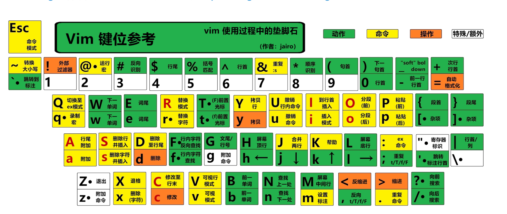

# 插件
## Vim
- [Vim下载地址](https://marketplace.visualstudio.com/items?itemName=vscodevim.vim)
- Vim键位：
  
- 个人配置：
```json
{
  "vim.useCtrlKeys": false, //禁用Vim中Ctrl相关快捷键
  "vim.easymotion": true,   // 启用 EasyMotion 插件功能,可以快速跳转到屏幕上的任意位置，
  "vim.incsearch": true,    // 启用增量搜索,输入搜索词时实时高亮匹配结果
  "vim.useSystemClipboard": true,   //使用系统剪贴板
  "vim.hlsearch": true, // 高亮所有搜索结果
  "vim.timeout": 180 ,  // 按键序列超时时间(ms)

  // 插入模式自定义按键映射
  "vim.insertModeKeyBindings": [
    {
      "before": ["j", "j"],
      "after": ["<Esc>"]
    },
    {
      "before":["j","<leader>"],
      "after":[" ", "=", " "]
    },
    {
      "before":["k","<leader>"],
      "after":[" ", "+", " "]
    },
    {
      "before":["i","<leader>"],
      "after":["("]
    },
    {
      "before":["o","<leader>"],
      "after":["_"]
    },
    {
      "before":["l","<leader>"],
      "after":["j", "j", "l", "a"]
    },
    {
      "before":["i","i"],
      "after":["*"]
    },
    {
      "before":["u","u"],
      "after":["&"]
    },
    {
      "before":["e","e"],
      "after":["Escape", "A"],
    },
    {
      "before":["a","a"],
      "after":["Escape", "I"]
    },
  ],


  // 普通模式自定义按键映射
  "vim.normalModeKeyBindingsNonRecursive": [
    {
      "before": ["<leader>","j"],
      "after": ["1","0","j"]
    },
    {
      "before": ["<leader>","k"],
      "after": ["1","0","k"]
    },
    {
      "before": ["K"],
      "commands": ["lineBreakInsert"],
      "silent": true
    },
    {
      "before": ["<leader>","t"],
      "commands": ["workbench.action.terminal.focus"]
    }   // 聚焦到 VSCode 终端
  ],
  "vim.leader": "<space>",
  "vim.handleKeys": {
    "<C-a>": false,
    "<C-f>": false
  },    // 禁用 Vim 对 Ctrl+A 和 Ctrl+F 的接管
}
```

## Todo Tree
- [Todo Tree 下载地址](https://marketplace.visualstudio.com/items?itemName=Gruntfuggly.todo-tree)
- 个人配置
```json
{
  // 自定义高亮关键词
  "todo-tree.general.tags": [
    "BUG",
    "HACK",
    "FIXME",
    "TODO",
    "XXX",
    "[ ]",
    "[x]",
    "TAG",
    "NOTE",
    "??"
  ],

  "todo-tree.highlights.defaultHighlight": {
  },

  // 自定义高亮样式
  "todo-tree.highlights.customHighlight": {

    "TODO": {
      "foreground": "#fff",
      "background": "#ffbd2a",
      "icon": "rocket",
      "iconColour": "#ffbd2a"
    },
    "BUG": {
      "icon": "bug",
      "foreground": "#fff",
      "background": "#ff2a2a",
      "iconColour": "#ff2a2a"
    },
    "TAG": {
      "background": "#38b2f4",
      "icon": "tag",
      "foreground": "#fff",
      "rulerColour": "#38b2f4",
      "iconColour": "#38b2f4",
      "rulerLane": "full"
    },
    "TEMP": {
      "foreground": "#fff",
      "background": "#ff7043",
      "icon": "clock",
      "iconColour": "#ff7043"
    },
    "FIXME": {
      "foreground": "#fff",
      "background": "#f06292",
      "icon": "flame",
      "iconColour": "#f06292"
    },
    "NOTE": {
      "foreground": "#fff",
      "background": "#64f321",
      "icon": "info",
      "iconColour": "#2196f3"
    },
    "??": {
      "foreground": "#fff",
      "background": "#ff9800",
      "icon": "question",
      "iconColour": "#fbff00"
    },
  },
}
```